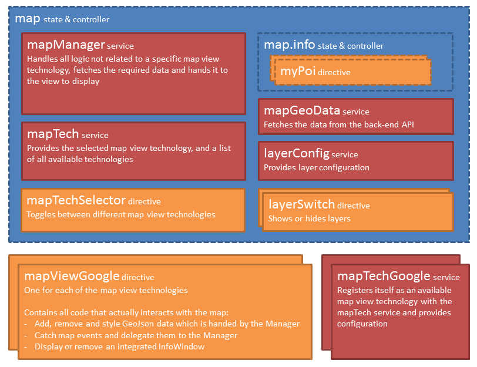

# GNaP Map plugin

Adds mapping functionality to the [GNaP](http://gnap.io/) Angular framework. Manages layers of [GeoJson](http://geojson.org/) data, independent of map API. Currently only [Google Maps](https://github.com/infrabel/gnap-map-google) is publicly available, but you can [create your own](https://github.com/infrabel/gnap-map/wiki/create-map-tech-package).

## Contents

- [Overview](#overview)
- [Who this library is for](#who-this-library-is-for)
- [Getting started](#getting-started)
- [Components](#components)
    + [Map manager service](#map-manager-service)
    + [Layer config service](#layer-config-service)
    + [Geo data service](#geo-data-service)
    + [Map tech service](#map-tech-service)
    + [Map tech selector directive](#map-tech-selector-directive)
    + [Layer switch directive](#layer-switch-directive)
- [Dependencies, contributing and license](#dependencies)

## Overview

This library attempts to abstract away the visualization of GeoJson data: it can be used with multiple 'map views', like Google Maps or Bing Maps. New map views can be created with minimal effort, by implementing the expected functions. The user can even switch between different engines interactively, using an included 'map technology selector' directive.

The GeoJson data should come from a REST endpoint. Both fetching all data at once, or only fetching data in the requested bounds (viewport) are supported. The library ensures optimal performance by only rendering items which are in the current viewport once, and only fetching new data when necessary.

The library makes it easy to create and configure new layers of data, when they should be shown, and how they should be displayed. This can be configured during the Angular *config* phase, or in a *run* block in case other services must be referenced.



## Who this library is for

This library can only be used together with the [GNaP framework](http://www.gnap.io) because it relies on components, packages and style used therein. It only makes sense to use this library if you primarily use at least one, but probably multiple (toggleable) layers of GeoJson data from a REST endpoint.

Don't use this library if you need to do entirely different things with a map, like only showing one or a couple of locations.

## Getting started

#### Installation

- Install this package using `npm install gnap-map` in your web project folder.
- Install a map technology, for instance [gnap-map-google](https://github.com/infrabel/gnap-map-google) by running `npm install gnap-map-google`, and following the [installation instructions](https://github.com/infrabel/gnap-map-google#installation) there.
- Reference the dist/gnap-map.css file and the dist/gnap-map.js file for the development version, or the dist/gnap-map.min.css and dist/gnap-map.min.js files for minified versions.
    - Reference them right after the GNaP css and js files. That way, they will get bundled along with GNaP in the vendor-gnap.css and vendor.js files by means of the GNaP `grunt dist` task.
    - **Note:** When installing the Google Maps technology, be sure to follow the instructions on referencing the Google Maps Javascript API in your index file.

#### Hello Worldmap

- If you hadn't already, create the state you wish to insert the map in, e.g. `main.map` (if you pick another state, you should reflect that in [the configuration](#configuring-the-map-manager)).
- Create a div with a height. Inside it, reference (one of) your installed map view directive(s), e.g.:  
    ```
    <div map-view-google style="width: 100%; height: 500px;"></div>
    ```
- Optionally, if you have installed more than one map technology/view, you can also include the 'map tech selector' directive, in the main.html view, right before the `gnap-locale-selector`, e.g.:  
    ```
    <li map-tech-selector class="light-blue"></li>
    ```

#### Configuration

Configure the [map manager](#configuring-the-map-manager), the [layers](#configuring-layers) to be used, and the [geo data service](#configuring-the-geo-data-service). Check out [the example](example/src/app/app.config.js#L44).

As a bare minimum, you'll probably want to set the center and zoom level of your map, configure at least one layer along with its style, and the endpoint of your API.

## Components

### Map manager service

The map manager coordinates between all other components. Its main purpose is to keep track of which data in which bounds has already been fetched, and only request new data when required. It also keeps track of the currently selected item and triggers some events.

#### Configuring the Map manager

Configure these static settings directly on the `mapManagerProvider`, during the config phase of your module.

- `setMapState`: Set the location of the basic map state; which is navigated back to when leaving the 'info' state. *Default: main.map*
- `setInfoState`: Set the location of the 'info' sub state; which is navigated to when clicking on a POI. *Default: main.map.info*
- `setTranslationLocaionBase`: Set the location which serves as the base for some translations, for e.g. layer names. Include the final dot. *Default: main.common.*

Anywhere in your application, you may set `mapManager.settings.skipCache` if you want to completely disable data layer caching and always fetch all data from the server.

#### Using the map manager

For regular usage, you should not need to call anything on the map manager: the map view will call `fetchAllDataInBounds` when required. However, you may want to *force* data for one or all layers to be refreshed, for instance after changing filters. For that, you can either call this method or the `fetchDataInBounds` method with the `refresh` option. Similarly, you may want to manually call `clearData` or `clearAllData`.

The currently selected item can and should be set on the `selected` property on the map manager, for instance on the state change to `map.info`.

Lastly, you can initiate several actions on the map view through the map manager, with the `mapView` property and its `viewPort` child property. If you want to check whether the map view supports the action, you can use the `mapManager.mapFunctionIsSupported` function and pass a reference to the desired function. Some commonly functions are `viewPort.setCenter` and `viewPort.setZoomLevel`. All functions are explained in detail in the [Map View directives](#map-view-directives) section.

#### Events

The map manager can emit the following events. Register to these on the `$rootScope` to handle them.

**`custom-shape-created`**

Emited when a shape was drawn on the map view. Parameters:

- `event` *(object)*: Default Angular event object.
- `wkt` *(string)*: The shape as [WKT](https://en.wikipedia.org/wiki/Well-known_text) in the coordinate system of the map view.
- `removeShapeFunction` *(function)*: After handling the event, if defined (if the map view supports this), call this function to remove the shape from the map view.

**`items-selected`**

When the map view supports multi-selection, this event is emited when the user has finished selecting items. Parameters:

- `event` *(object)*: Default Angular event object.
- `selectedItems` *(object)*: An object with all the selected items, grouped by their `itemType`. Each property on the object is an item type, which is again an object, with a property `ids`, which is an array containing all the id's of the selected items of that type. Be sure to check whether all these properties exist.

#### Item details

The GNaP Map library allows (and even expects by default) each feature to have details which can be shown in an info window when clicked. The application's state (and hence, uri) will change to reflect this new state. This allows direct linking to the details of any item.

The only thing the map manager will do when an item is clicked, is that it will navigate towards the state that was [configured](#configuring-the-map-manager) through the `setInfoState` provider function (`main.map.info` by default), with two state parameters: the data layer's `type` and the item's `id`.

> Note that if the feature id contains an underscore, the map manager assumes the format of 'type_numericalId'. In this case, the type_ prefix is stripped from the id in the state parameter. If you want this included again later on, you must prepend it again.

It is then up to the info state's `resolve` function and/or the controller to:

1. Fetch the desired data; optionally adding any other parameters
2. Set the following properties on the mapManger: `mapManager.selection.id`, `mapManager.selection.type` and `mapManager.selection.details`
3. If the map view directive's proper tooltip should be displayed, `mapManager.mapView.showInfoWindow({lat, lng})` should be called
4. In that case, the info controller should also close the info window again upon destruction:  
    ```javascript
    $scope.$on('$destroy', function () {
        mapManager.mapView.closeInfoWindow();
    });
    ```

If you have layers with items which don't have details, you must opt out of this behavior by setting the `hasNoDetails` layer property to `true`.

### Layer config service

Used to configure and retrieve the GeoJson data layer configuration.

#### Configuring layers

Use `setDataLayers(object)` at config time on the provider *or* at run time on the service to set data layer configuration. In both cases, the function takes one argument: an object where each property represents a layer. The property name is the key of the layer and should be the same as its `itemType` property. All layer properties are discussed [in the wiki](https://github.com/infrabel/gnap-map/wiki/Layer-properties).

Any time you call `layerConfig.setDataLayers(object)` at run time, the passed object recursively into the already existing data layer configuration object. If a property already existed, it is overridden.

In case you don't need services, it suffices to call `setDataLayers(object)` in a `config` block. If you do need services, you can (also) call `setDataLayers(object)` in a `run` block. You should put all layer configuration in either of these blocks at startup time of your application.

#### Using the layers service

You can access the layer configuration at any time by calling `getDataLayers()` on the service. This returns a reference to the **static** layer config object (if one has been set), 'merged' with the dynamic config. 

> Note that any changes to the static properties will be stored on the object for the duration of the application.

### Geo data service

Gets the GeoJson data for a specific layer from a REST endpoint. Either all data of the specified type (which can then be cached locally by the map manager), or only the data within the specified bounds.

> Note that currently, the bounds should be passed as WGS 84 coordinates, but the returned GeoJson can be in any coordinate system as specified in the `mapTech` spec.

#### Configuring the Geo data service

There are two types of configuration: `config`-phase configuration on the provider, and configuration set during the `run`-phase, which can include other services.

##### Config-time configuration

- `setEndpointUri` on the `mapGeoDataProvider`: Set the base endpoint which the service should retrieve its data from. Should include a trailing slash. After this, the resource's uri is appended.

##### Run-time configuration

- `setConstructResourceUriFunction`: Optionally specify a function which accepts two parameters: the `dataLayer` *(object)*, and an optional `all` *(bool, optional, default false)*. Must return the uri which should be appended to the `endPointUri` which was configured in the `config` block.  
By default, the function returns the `dataLayer`'s `resourceUri` property. In case `all` was set to `true`, it appends `/all` to the uri.

- `constructParamsFunction`: Optionally specify a function which accepts a `dataLayer` parameter and returns an object which should be set as the `params` option in the `$http.get` request.  
By default, this is an empty object.  
Note, however, that the service will automatically add the following parameters:
    - WGS 84 bounds in the following format:  
    ```json
    {
        "neLat": 51.04019084947656,
        "neLng": 2.904200414924617,
        "swLat": 51.02475337327745,
        "swLng": 2.8353642027664137
    }
    ```
    - If required (when different from the default wgs84), the expected output coordinate system in the following format:    
    ```json
    {
        "result": "lambert72"
    }
    ```

#### Using the geo data service

You should normally not have to call anything on this service; the `mapManager` should automatically make the required calls. You may however call `getAll(dataLayer)` or `getInBounds(dataLayer, bounds)` manually.

#### GeoJson Requirements

The GeoJson returned by the REST API must meet a couple of requirements for the GNaP Map plugin to be able to work with it, and there are a couple of optional properties. These are discussed in detail [in the wiki](https://github.com/infrabel/gnap-map/wiki/geojson-properties). Summarized, each feature must have a unique id, and a `type` property which corresponds to the data layer's `itemType`. In case the geometry of the Feature is a `Polygon`, it must also contain a `center` property.

### Map tech service

Keeps track of registered map technologies.

In your application, you may want to check which map technology is currently selected. For this, you can use the `mapTech.is(key)` function. You may also want to retrieve the map technology's coordinate system, using `mapTech.getCoordinateSystem()`.

### Map tech selector directive

When using more than one map technology, you can let the user choose his preferred technology with this directive. Insert it right before the GNaP language selector:

```html
<li map-tech-selector class="light-blue"></li>
<li gnap-locale-selector class="light-blue"></li>
```

### Layer switch directive

This directive allows users to toggle on/off a single [data layer](#configuring-layers). The directive has the following attributes:

- `layer`: The `itemType` of the data layer.
- `alwaysEnabled`: Display the layer as being 'available', even if the current zoomlevel does not fall between the layer's minimum and maximum zoom levels.
- `linkedLayers`: Comma-separated list of `itemType`s of layers which must also be *refreshed* when toggling this layer. Note that it does *not* necessarily toggle these linked layers on and off. Generally, this can be used in case the linked layers' `shouldShowFunction` implementations depend on this layer's visibility.


## Dependencies

- The Angular version of [GNaP](http://gnap.io/)
- [ui-select](https://github.com/angular-ui/ui-select)

## Contributing and example

When contributing, you can test the library using the included example. Normally, you would install this library through npm, but evidently this is not possible for this example. To 'publish' the library to the example's node_modules folder, run `grunt dist`.

Note that the example also uses a copy of the gnap-map-google map technology. This is installed as an actual npm dependency. *TODO*

The example is a basic GNaP application, which you can run using **`grunt serve`** from the example folder. By default it runs on port 9002.

The example also includes a tiny REST API service, which you can run using **`node server`**. By default it runs on port 9003. It uses test data from the test_data folder.

Before publishing (and preferably, also before pushing), do not forget to run `grunt dist` to generate up-to-date script files in the dist folder.

## License

themes-gnap is licensed under [BSD (3-Clause)](http://choosealicense.com/licenses/bsd-3-clause/ "Read more about the BSD (3-Clause) License"). Refer to [LICENSE](https://github.com/infrabel/themes-gnap/blob/master/LICENSE) for more information.

The GNaP theme uses ```Ace - Responsive Admin Template``` as its base theme, which is licensed under [Extended License](https://github.com/infrabel/themes-gnap/blob/master/custom/ace/LICENSE-Ace), our license covers redistribution and usage by you. However, if you would like to show your support to the original author, you can [buy a Single application license here](https://wrapbootstrap.com/theme/ace-responsive-admin-template-WB0B30DGR?ref=cc), it's quite cheap after all.